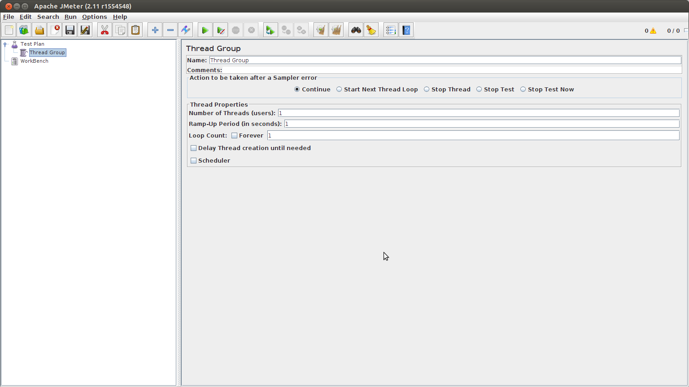
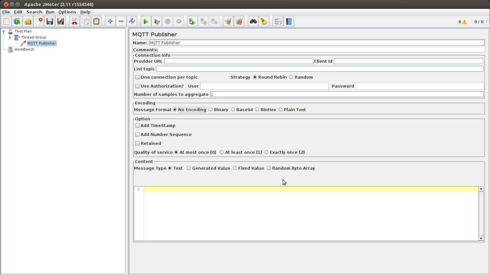

mqtt-jmeter
===========

This is the plugin for Jmeter to Test MQTT protocol

Tuan Hiep
ERODS Team
LIG- Grenoble-France

# Introduction

The MQTT Plugin in Jmeter is used for the injection testing of MQTT server. It permits the complete
test correspond many scenarios, which depend on type of messages, type of connections. Thanks to it's
interface graphic, the fact of testing mqtt protocol is taken easily.

# How to install MQTT plugin in Jmeter

From the repository: https://github.com/tuanhiep/mqtt-jmeter  
Get the source code, go to mqtt-jemeter folder and and use the command maven in terminal (Ubuntu):

	mvn clean install package

to obtain the file **mqtt-jmeter.jar** in **mqtt-jemeter/target**.  
Put the **mqtt-jemeter.jar** in the folder **lib/ext** of Jmeter
(to be downloaded on http://jmeter.apache.org/download_jmeter.cgi ).

Remind that, it's necessary to update the file **ApacheJMeter_core.jar** in the repository lib/ext of Jmeter.
Update the file messages.properties in the folder :/org/apache/jmeter/resources/
in ApacheJMeter_core.jar by new file messages.properties from
https://github.com/tuanhiep/mqtt-jmeter/tree/master/ressource

#  How to use MQTT plugin in Jmeter

##  MQTT Publisher

The interface graphic of Jmeter:

Right-click “Thread” and choose : Add → Sampler → MQTT Publisher

In the principal interface of MQTT Publisher we have the fields:

*Name:* Name of the MQTT Publisher  
*Comments:* Your comments  
*Provider URL:* the address of MQTT server example: tcp://localhost:1883  
*Client Id:* Your Id in the session with MQTT server example: Noel De Palma  
*Topic:* The topic's name you want to publish
*Use Authorization check box:* Necessary in the case the connection needs the username and
password  
*User:* Your username  
*Password:* Your password  
*Number of samples to aggregate:* In other way, the number of messages you want to publish to
the MQTT sever in this MQTT Publisher thread, with the value like the configuration below.  
*Message Type:* You can choose : Text, Generated Value, Fixed Value (more detail below)  

• Add TimeStamp check box : Add the timestamps to the message. The timestamps is 8 bytes
• Add Number Sequence check box: Add the number sequence to the message. Example: if you
publish 100 messages in your session, the message is numbered from 0 to 99. The number
sequence field in the message is 4 bytes.
• Retained check box: You publish the messages as retained messages or not. The retain flag for an
MQTT message is set to false by default. This means that a broker will not hold onto the
message so that any subscribers arriving after the message was sent will not see the message. By
setting the retain flag, the message is held onto by the broker, so when the late arrivers connect
to the broker or clients create a new subscription they get all the relevant retained messages”
• Quality of service: Three levels:
0 : At most once
1 : At least once
2 : Exactly once
Each message in MQTT can have its quality of service and retain flag set. The quality of service
advises the code if and how it should ensure the message arrives. There are three options, 0 (At Most
Once),1 (At Least Once) and 2 (Exactly Once). By default, a new message instance is set to "At
Least Once", a Quality of Service (QoS) of 1, which means the sender will deliver the message at

